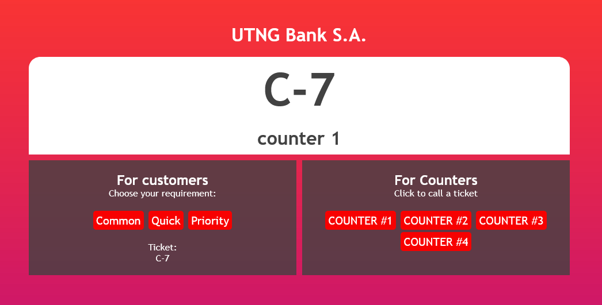

<h1 align="center">
 
    UTNG QUEUE

</h1>

A queue system which aims to be simple and effective

  

## Features
Below are all features used on this project:

- **HTML5** — Standard markup language
- **CSS3** — Stylization language
- **Javascript** — Programming language

 

## License

This project is licensed under the MIT License - see the [LICENSE](https://opensource.org/licenses/MIT) page for details.
